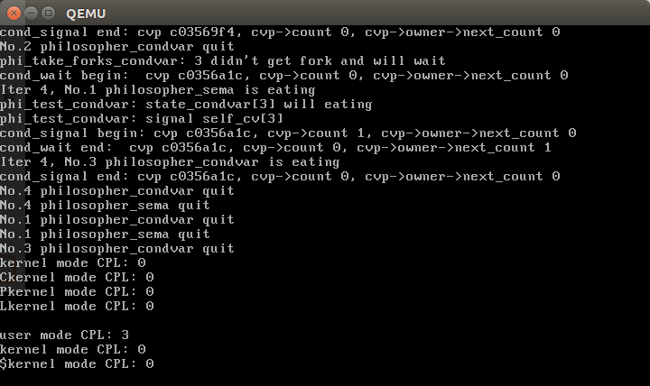
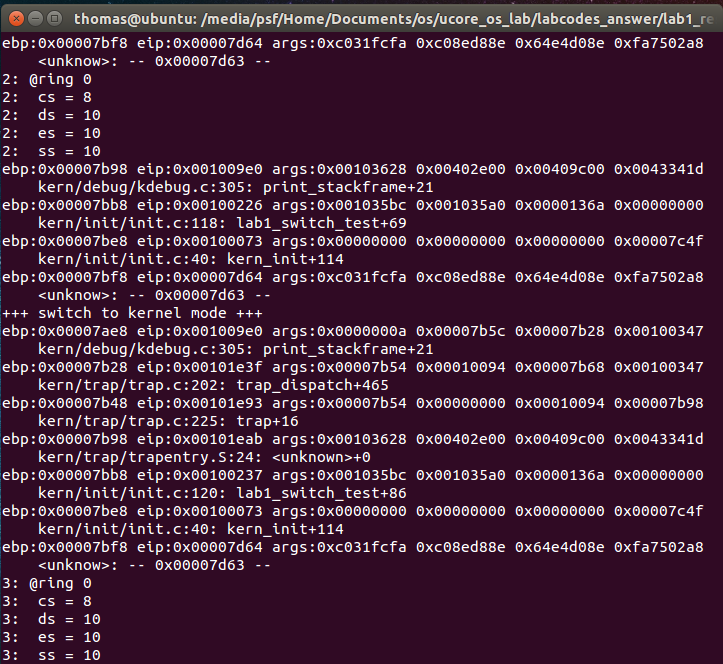
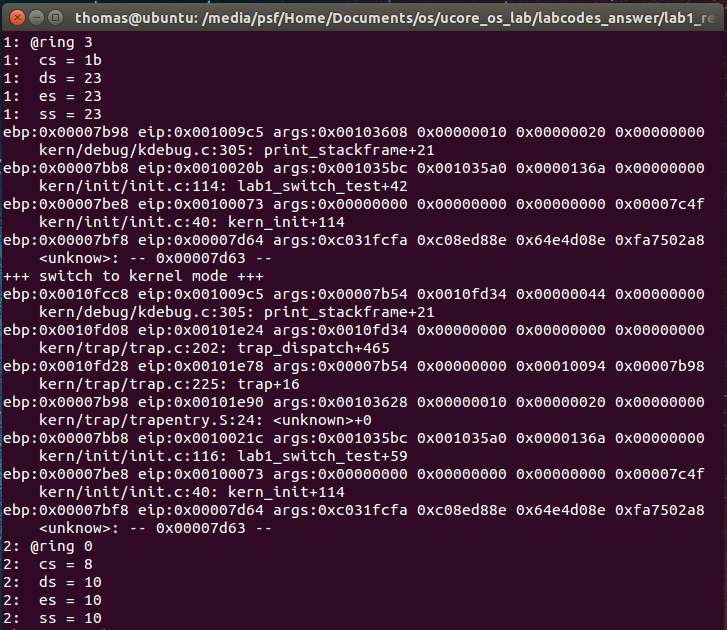

# lab1 SPOC思考题


## 各知识点的小练习

### 4.1 启动顺序
---


描述符特权级DPL、当前特权级CPL和请求特权级RPL的含义是什么？在哪些寄存器中这些字段？对应的访问条件是什么？ (challenge)写出一些简单的小程序（c or asm）来体现这些特权级的区别和联系。
 ```
  + 建议参见链接“ http://blog.csdn.net/better0332/article/details/3416749 ”对特权级的表述，并查阅指令手册。
  - 
 ```

  - CPL：当前进程的权限级别，代码段寄存器CS中的CPL字段（2位）的值等于CPU当前的特权级。
  
  - RPL：数据段选择子中的内容可以加载到各个段寄存器（如SS、DS），低两位为请求特权级（RPL），表示进程对段的访问权限。
  
  - DPL：描述符特权，储存在段描述符中的权限位，用于描述对应段所属的特权等级，每个段的DPL固定。

  - 访问条件：max(RPL,CPL)<=DPL
  
  - 输出CPL程序：
  
  ```c
  int cs = 0;
  asm volatile("movl %%cs, %0\n" : "=r"(cs));
  cs &= 3;
  cprintf("user mode CPL: %d\n", cs);
  ```
  在syscall.c中，同样输出CPL。
  结果如下：
  
  


> 

---

### 4.2 C函数调用的实现
---

比较不同特权级的中断切换时的堆栈变化差别；(challenge)写出一些简单的小程序（c or asm）来显示出不同特权级的的中断切换的堆栈变化情况。

 - uCore中CPU只用到2个特权级：0（内核态）和3（用户态）。
 - 当处于内核态时，中断切换时堆栈不需要切换，即一直是内核态堆栈；
 - 当处于用户态时，中断时堆栈从用户态堆栈切换到内核态堆栈，中断处理结束后堆栈再回到用户态堆栈。

 - 程序：
 - `lab1_switch_test(void)` 函数中有内核态与核心态的切换，即通过`int T_SWITCH_TOU`和`int T_SWITCH_TOK`来切换。修改该函数如下

	```
	static void
 	lab1_switch_test(void) {
 		lab1_print_cur_status();
    	print_stackframe();
    	cprintf("+++ switch to  user  mode +++\n");
    	lab1_switch_to_user();
    	lab1_print_cur_status();
    	print_stackframe();
    	cprintf("+++ switch to kernel mode +++\n");
    	lab1_switch_to_kernel();
    	lab1_print_cur_status();
    	print_stackframe();
	}
	```
 - 即在进入中断之前用`print_stackfram()`打印栈帧，在`trap.c`中也在处理这两个中断的时候打印栈帧。结果如下所示：
 - 内核态 => 内核态（堆栈没有切换）
 - 
 - 用户态 => 内核态（堆栈进行了切换）
 - 

> 

---


## v9-cpu相关题目
---

### 提前准备
```
cd YOUR v9-cpu DIR
git pull 
cd YOUR os_course_spoc_exercise DIR
git pull 
```

### v9-cpu的执行过程(challenge)
  1. 参考os*.c，写一个小程序，能够显示在用户态无法执行的所有特权指令，能够显示出不同特权级的的中断切换的堆栈变化情况。
  1. 扩展em.c，可以打印v9-cpu执行的每一条指令和寄存器状态
  1. 扩展em.c，在产生fatal错误后，把这之前执行的n条指令和寄存器状态打印出来
  1. 扩展c.c和em.c，使得可以指定em.c能够跟踪并打印执行程序中对全局变量的读写或修改的指令，以及指令的执行情况
  1. 扩展em.c的debugger功能，可以设置断点
  1. 扩展em.c的debugger功能，可以任意打断当前执行程序的执行，回到debugger
